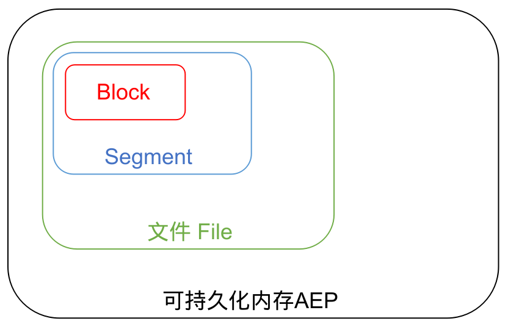
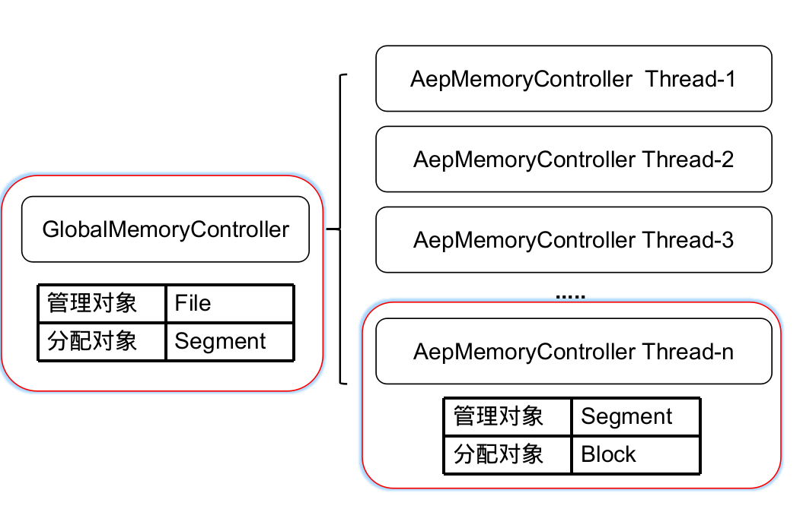
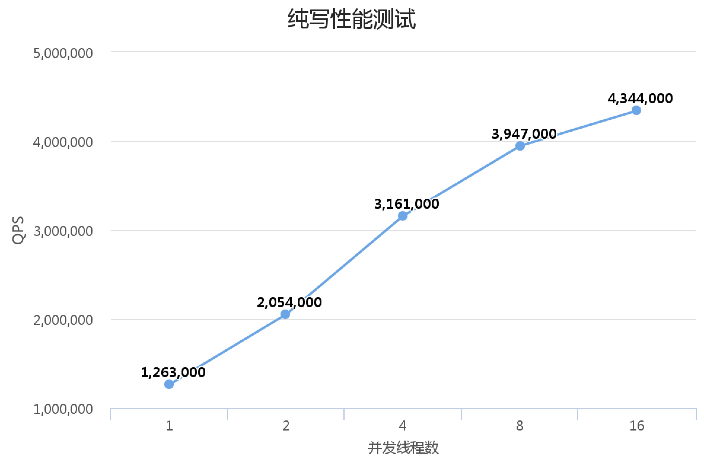
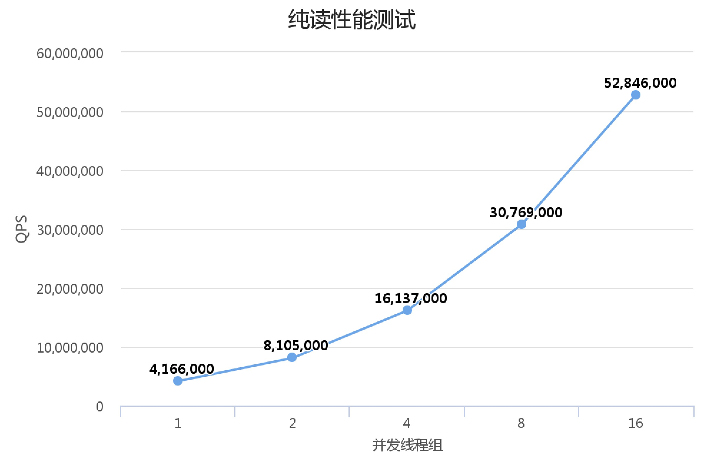
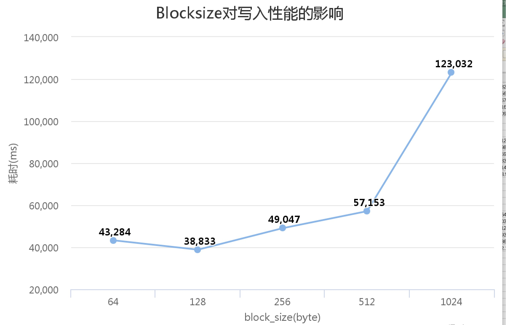

# <center>基于可持久化内存-AEP的KV存储引擎</center>
> 一份简单的AEP上手指南

# QuicklyStart

- 切换到测试程序目录
```shell script
cd ../judge
```
- 通过judge程序对KV存储进行一些测试

```shell script
**
-s :set size per Thread.
-g :get size per Thread.
-t :num threads.
**

./judge -s 10000 -g 10000 -t 5
```
上面的命令就是5个线程并发，每个线程在纯写阶段写入10000条数据；在纯读阶段，每个线程执行10000次Get请求。单线程请求数量不超过1000万。

示例：

```shell script
./judge -s 10000000 -g 10000000 -t 16
Init config block size:64 block per segments:65536
---------------Performance Test-------------
pure write time:31558.22 ms
 pure read time:4527.57 ms
---------------Correctness Test  -------------
sum sample: 160000
right: 160000
wrong: 0
```
其中17.49为纯写入耗时，3.77为纯读的时间

# 设计思想
## AEP简述
### 什么是AEP？
持久化内存（Persistent Memory，简称 PMEM），也叫非易失性内存（Non-Volatile Memory，简称 NVM），是指一类支持字节寻址（byte-addressable）、可以通过 CPU 指令直接进行操作、断电后数据不丢失的存储硬件。
### AEP的两种使用模式
Optane DIMM 有两种工作模式：Memory Mode 和 App Direct Mode。

- Memory Mode 简单说就是把 Optane DIMMs 当成易失性内存使用，把 DRAM 当作 CPU 和 Optane DIMMs 之间的 cache，并且 DRAM 对外不可见（就像 CPU 的多级 cache 对外也不可见）。基于 Memory Mode 的工作模式，可以通过应用无感知的方式，解决一些内存数据库（比如 Redis、Memcached）单机 DRAM 容量不足或成本过高的问题。
- App Direct Mode 将 Optane DIMMs 当成一个持久化设备来使用，直接通过 CPU 指令读写 Optane DIMMs，不需要经过 DRAM。应用可以使用能够感知持久化内存的文件系统（比如 EXT4-DAX、XFS-DAX、NOVA）或其他组件（比如 PMDK）来管理、操作持久化内存设备。
  
显而易见**本项目中使用的是App Direct Mode**，即将aep挂载到文件系统中使用。

### PMDK工具库
正如开题所说，在App Direct Mode模式下，我们可以简单的把AEP作为非常快的硬盘使用，使得应用可以不用做任何变动直接迁移上去，但是这样的不足之处就是无法充分发挥AEP的性能。为了能够对AEP的使用进行细力度的优化，Interl官方提供了一套工具库-PMDK。PMDK 的全称是 Persistent Memory Development Kit，它包含了 Intel 开发的一系列旨在 方便非易失性内存的应用开发的函数库和工具。


## 数据结构
整体的KV设计采用的是哈希的结构，主要分为内存部分和AEP部分，这里注意没有涉及到硬盘。整体的思想是采用了**数组加链表**的形式来实现哈希结构。**此外为了降低实现难度，我们将key设定为定长，val为80-1024byte的变长字符串**。

### 内存中的数据结构
内存中的数据结构主要分为两个部分：1. entry 2. key的索引信息；两者都是以数组的形式。

**Entry数组**
其主要是为了保存链表的头部，示例代码如下：
```c++
class Entry {
 public:
  Entry() : head_(UINT32_MAX){};
  ~Entry() = default;

  KEY_INDEX_TYPE getHead() const {
    return this->head_.load(std::memory_order_relaxed);
  }
  // set head and return the old one
  KEY_INDEX_TYPE setHead(const uint32_t _key_index) {
    return this->head_.exchange(_key_index, std::memory_order_relaxed);
  }

 public:
  std::atomic<KEY_INDEX_TYPE> head_;
};
```
每个enrty中只保存了链表头的位置，**head**其指向的是头节点的KEY在key的索引信息中的位置并通过atomic来保证更新的一致性。每个enrty占用4个字节.

**key的索引信息**
上面已经提及key的索引信息，同样是以数组的形式保存的，其中每个节点主要保存了以下几点信息，这里我们以伪代码的形式说明以下：
```c++
typedf struct KeyInfo {
  uint_16 version_;
  uint_16 val_length_;
  uint_32 block_index_;
  uint_32 next_index_;
  char[16] key_;
}
```

成员变量说明：
- **version_**：版本号，主要用于在recovery的时候，去除过时的数据。
- **val_length_**:value的长度，主要用于val的读取，以及aep内存的回收。
- **block_index_**：这个kv在内存中的block索引，关于block的定义在后面。
- **next_index_**：链表中下一个key的位置。
- **key_**:key值。

### AEP中的数据结构
这里采用的是key、val在内存中组装成record，一次写入AEP并执行持久化操作的思想。

**为什么要这么做呢？**

假设我们将所有的key/value分成两个部分存，首先显而易见的是会增加对于aep的io，而显而易见的是DRAM本身还是要快于AEP的；此外，为了保证单条写入的原子性需要执行两次，而aep的持久化函数**pmem_drain**，本身相当于一个内存屏障，降低了并发。

目前一条Record在AEP中的表示如下

<center>图一. Record结构</center>

- **VAL_LEN**:value的长度
- **KEY**:key值
- **VERSION**：版本号
- **VALUE**：value值
- **CHECK_SUM**：主要用于recovery

## 断电恢复
考虑到value为定长字段为不定长的字段，为了实现一次写入请求的原子性，我采取了对写入数据计算checksum的方法，将checksum与其它相关数据一并写入，做到单次kv写入只需要执行一次持久化操作。具体的恢复流程如下：


<center>图二. 计算CHECK_SUM</center>

- 首先在内存中组装Record，然后计算如图二所示中字符串的hash值作为CHECK_SUM一并写入。
- 目前，AEP被划分为以Block为最小单位的内存块，而内存的申请与回收都是以Block为基本单位。因此在恢复的时候，我们遍历所有Block对取出的一条数据计算CHECK_SUM，与Record中记录的进行对比，如果相同则通过校验。

## AEP的GC设计
如果所示，我们将AEP内存主要分为了三个层次：File、Segment、Block。

<center>图三. AEP内存结构</center>

### FILE
如上文所讲，我们采用的是AD模式，即将AEP以硬盘的模式挂载到文件系统。因此，我们首先建立一个文件，同时以PMDK提供的pmem_map映射到内存，这样我们便可以直接对文件进行操作。而GC的目的正是为了更好的管理File内部的aep内存。

### Segment
线程级内存管理器-**AepMemoryController**向**GlobalMemoryController**申请aep内存的基本单位。后面会介绍这两者。

### Block
GC逻辑中管理的最小单位，为一个固定的size的空间，即对于一条Record的申请aep内存的请求，**AepMemoryController**会根据大小分配出n个block大小的空间。在官方的文档中，我们可以了解到如下两点：

- cache line size between memory controller and the Optane DIMM is 64 bytes, 
- the actual physical access granuality is 256 bytes. 
因此，我们默认每个block的size为64byte，这样保证数据都是按照64对齐。


为了提高并发效率，对于AEP的GC策略，如图五所示，我们采用的是threal local + global的方式。这里存在两个管理器：**AepMemoryController**和**GlobalMemoryController**。其中GlobalMemoryController主要是负责管理整个File的内存，而AepMemoryController则是被线程所有，负责线程级别的内存管理。
 

<center>图五. **AepMemoryController**和**GlobalMemoryController**</center>


在介绍两者之前我们先介绍以下FreeList。

## FreeList
FreeList负责维护的是碎片化内存的管理，提供Push和Pop接口。目前其内存实现比较简单，主要是维护了一个hashmap的结构存储了不同大小的Block。代码如下：
```c++
class FreeList {
 public:
  FreeList() = default;
  virtual ~FreeList() = default;
  virtual void Push(BLOCK_INDEX_TYPE _block_index, size_t _size) = 0;
  virtual bool Pop(BLOCK_INDEX_TYPE* _block_index, size_t _size) = 0;
  bool ThreadSafePop(BLOCK_INDEX_TYPE* _block_index, size_t _size) {
    bool flag;
    mt.lock();
    flag = Pop(_block_index, _size);
    mt.unlock();
    return flag;
  }
  virtual void MergeTo(FreeList* src_free_list, FreeList* dst_free_list) = 0;
};
```

## GlobalMemoryController
GlobalMemoryController主要是负责管理整个File的内存，其主要职责如下：

\* **负责对于AepMemoryController的allocate请求分配一个Segment**
 
 接口如下：
 ```c++
 bool Allocate(BLOCK_INDEX_TYPE* _block_index)
```

\* **负责维护一个全局的freelist**

在执行recovery的时候，会将碎片化的内存存储到全局的FreeList中。

\* **在内存紧张时可以提供一个扮演内存的角色，负责将内存中的大对象存储到AEP中**

首先来说，AEP本身存在两种模式，memory模式与AD模式。对于AD模式，如果我们没有执行持久化操作，即pmem_persist，其效率其实与memory存在差别但是不大。因此考虑如下情景：
- 内存使用非常紧张
- kv存储此时以读请求为主
  
这时我们可以将内存中的大对象，放到AEP中申请保存。此外，在recovery的时候，因为校验CHECK_SUM存在，这段用于起临时作用的aep内存会被GlobalMemoryController回收。

## AepMemoryController
AepMemoryController主要是线程级别的资源，主要包括两个方面：一个segment的连续内存和一个FreeList管理的碎片化内存。

```c++
// 申请AEP内存
bool New(int _size, BLOCK_INDEX_TYPE* _index)

// 释放AEP内存
bool Delete(int _size, BLOCK_INDEX_TYPE _index)
```
- _size: 申请Block的数量
- _index: 返回的block index


## AEP内存分配的优先级
根据优先级排列如下：

1. AepMemoryController-连续内存
2. AepMemoryController-碎片内存
3. GlobalMemoryController-连续内存
4. GlobalMemoryController-碎片内存

## Reference
- Aep的结构介绍：https://software.intel.com/content/www/us/en/develop/videos/overview-of-the-new-intel-optane-dc-memory.html
- PMDK的介绍：https://pmem.io/pmdk/
- Yang J , Kim J , Hoseinzadeh M , et al. An Empirical Guide to the Behavior and Use of Scalable Persistent Memory[J]. arXiv, 2019.
- 官方的编程指南《Programming Persistent Memory》

# 测试

测试环境： centOS 7.6/8*128G AEP/4通道
## 线程
为了验证AEP的并发读写能力,我们分别在1,2,4,8,16五种不同数量的线程组下进行了纯写,纯读和读写混合的测试,并记录QPS信息. 其中纯读和纯写测试中,单线程访问AEP的次数均为10000000次,最终的测试结果如图所示:



## BlockSize 
为了确认block_size在申请AEP内存空间时对整体性能的影响,我们进行了基于不同block_size的单线程5000000次纯写测试,测试结果如图所示:



